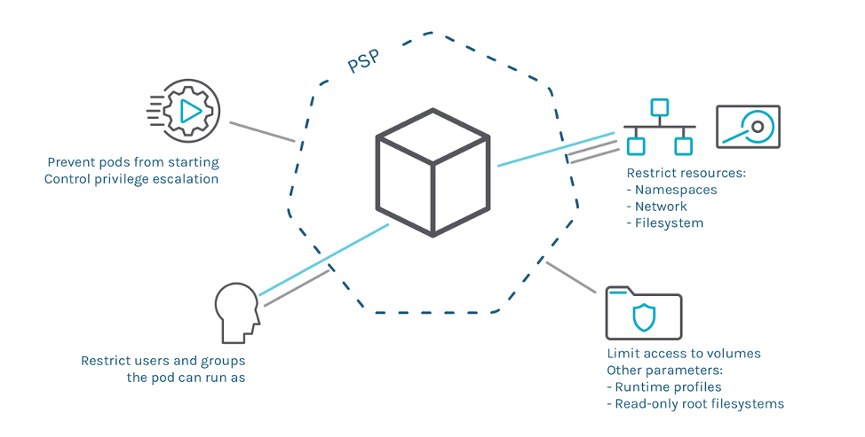

# EOL for the Pod Security Policies (PSPs)

## Prerequisites:
* Understanding of K8s Pod Security Policies (PSP)
* 5-10 minutes to spare.

## Quick refresh of the PSP - memories bring back memories

Kubernetes 1.21 started the deprecation process for PodSecurityPolicy.The current plan is to remove PSP from Kubernetes in the 1.25 release.
But, what?? went so wrong that a feature, which was introduced way back in v1.3 and used by many despite being in beta is set to be replaced.
We will talk about to the replacement options later (very soon) but its worth understanding the pain points first. There is a saying “A Problem Well Stated is Half Solved”.
So, following are some of the well discussed reasons in CNCF. Ofcourse i am no expert to list all the downsides here.

## Problem 1: Flawed Authorisation Model

 * Granting permissions to the user is intuitive but breaks the controllers.Generally psp is written to keep pods in the mind but no one runs pod directly.
 * Dual Mode weakens security, if someone (cluster admin) provides clusteradmin role with "privileged PSP" (human error) binds through RBAC (rolebinding) to a namespace.
 * Privileged pod can screw up another pod in another namespace.

## Problem 2: Difficult to Rollout

* Since this is an admission controller each and every pod will need a policy definition to get scheduled.
  No PSPs means all pods are denied.
* No “dry run” or No "audit mode", it’s impractical to retrofit PSP to existing clusters safely, and it’s impossible for PSP to ever be enabled by default.

## Problem 3: Inconsistent Unbounded API.

* Two or more policies to a single user/service/pod can be assigned which often results in privileges esclations.
* Weak prioritisation model which is based on alphabetical order. (Sometimes order of policy update in apiserver/etcd endup in unexpected results)
* Many niche usecase requests not supported. Example: No provision to have a policy based labels,scheduling,fine grained volume controls etc.
* Needs understanding of linux security primitives. Example Capabilities.
* Lastly API grown organically with lots of inconsistency which will be difficult to maintain.

# Reference
https://kubernetes.io/blog/2021/04/06/podsecuritypolicy-deprecation-past-present-and-future/#why-is-podsecuritypolicy-going-away
